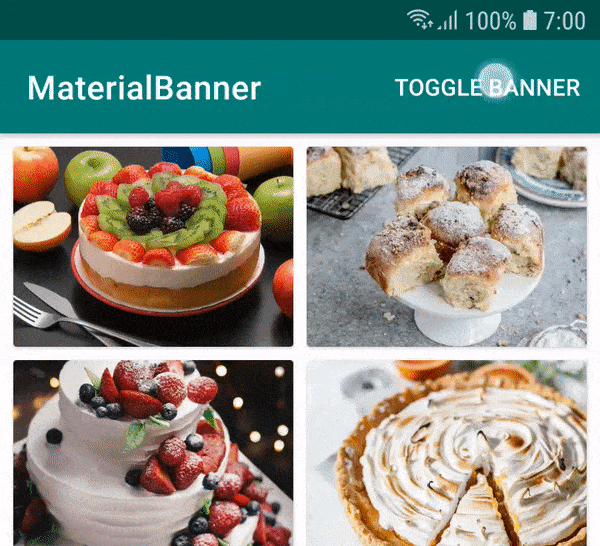
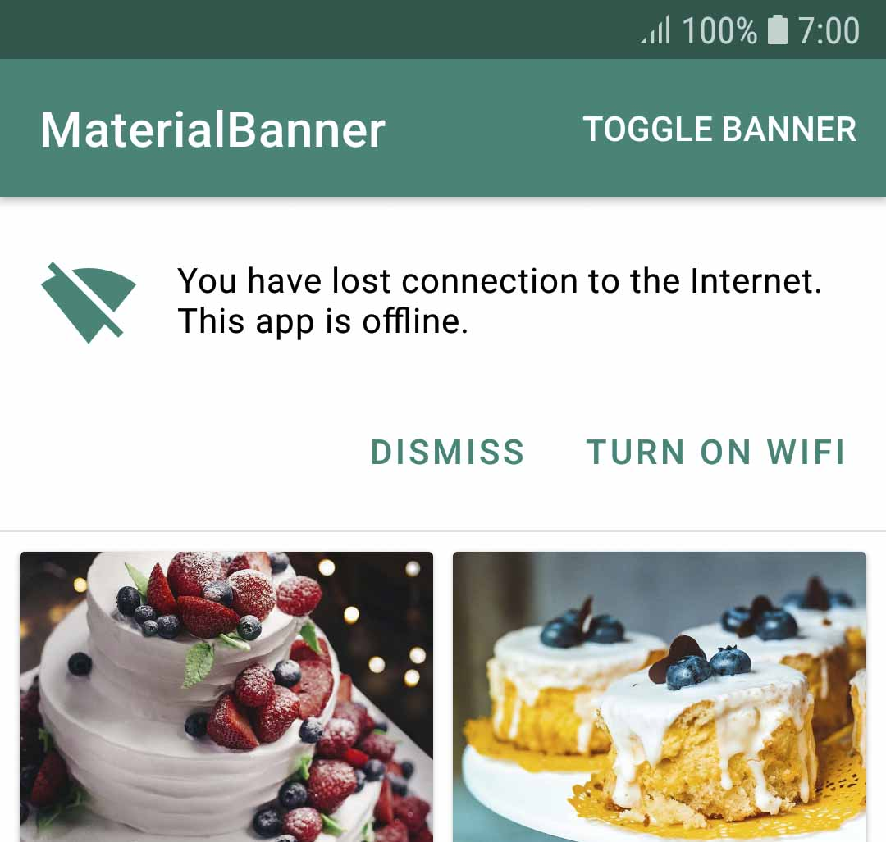

# MaterialBanner [  ](https://bintray.com/sergivonavi/maven/MaterialBanner/_latestVersion) [](https://opensource.org/licenses/Apache-2.0) [](https://android-arsenal.com/details/1/7605)
> A banner displays a prominent message and related optional actions.

MaterialBanner is a library that provides an implementation of the banner widget from the Material design.

[Banners - Material Design](https://material.io/design/components/banners.html).



# Preview



You can download the sample app here.

# Setup

## Add the gradle dependency

```
implementation "com.sergivonavi:materialbanner:1.2.0"
```

## Check your theme

In order to use this banner your app theme should inherit from a Material Components theme.

More about that: [Getting Started - Material Components for Android](https://material.io/develop/android/docs/getting-started/).

## Create your banner

### In your `layout.xml`:

```
<com.sergivonavi.materialbanner.Banner
    android:id="@+id/banner"
    android:layout_width="match_parent"
    android:layout_height="wrap_content"
    android:visibility="gone" // don't hide if you want to show this banner everytime
    app:buttonLeftText="Dismiss"
    app:buttonRightText="Turn on wifi"
    app:icon="@drawable/ic_signal_wifi_off_40dp"
    app:messageText="You have lost connection to the Internet." />
```

then in your Activity/Fragment:

```
Banner banner = findViewById(R.id.banner);
banner.setLeftButtonListener(new BannerInterface.OnClickListener() {
    @Override
    public void onClick(BannerInterface banner) {
        // do something
    }
});
banner.setRightButtonListener(new BannerInterface.OnClickListener() {
    @Override
    public void onClick(BannerInterface banner) {
        // do something
    }
});
// show when needed
banner.show();

// and later on
banner.dismiss();
```

### From the code using [Builder](https://github.com/sergivonavi/MaterialBanner/blob/7b9c7776e90c18bdde33c94c78d4652442c078eb/library/src/main/java/com/sergivonavi/materialbanner/Banner.java#L1094):

```
Banner banner = new Banner.Builder(context).setParent(rootView)
    .setIcon(R.drawable.ic_signal_wifi_off_40dp)
    .setMessage("You have lost connection to the Internet. This app is offline.")
    .setLeftButton("Dismiss", new BannerInterface.OnClickListener() {
        @Override
        public void onClick(BannerInterface banner) {
            banner.dismiss();
        }
    })
    .setRightButton("Turn on wifi", new BannerInterface.OnClickListener() {
        @Override
        public void onClick(BannerInterface banner) {
            // do something
        }
    })
    .create(); // or show() if you want to show the Banner immediately
    
    ...
    
    banner.show();
```

__DO NOT forget__ to call _Builder#setParent(...)_.
Pass here a ViewGroup that will be a parent for your banner.

Or you can use:
* _setParent(ViewGroup, int)_ to specify the index of the banner in ViewGroup's hierarchy;
* _setParent(ViewGroup, int, ViewGroup.LayoutParams)_ to change the default LayoutParams.

### Note

You don't need to set both left and right buttons: you can set one of them (doesn't matter which one).

# Additional setup

## Add listeners

If you want to know when your banner was shown or dismissed you can set appropriate listeners from [BannerInterface](library/src/main/java/com/sergivonavi/materialbanner/BannerInterface.java):

```
banner.setOnDismissListener(new BannerInterface.OnDismissListener() {
    @Override
    public void onDismiss() {
        // do something
    }
})
banner.setOnShowListener(new BannerInterface.OnShowListener() {
    @Override
    public void onShow() {
        // do something
    }
})
```

Or chain these calls to the Builder:

```
new Banner.Builder(context)
    ...
    .setOnDismissListener(new BannerInterface.OnDismissListener() {
        @Override
        public void onDismiss() {
            // do something
        }
    })
    .setOnShowListener(new BannerInterface.OnShowListener() {
        @Override
        public void onShow() {
            // do something
        }
    })
    ...
```

# Styling

For the style guidelines read [Banners - theming](https://material.io/design/components/banners.html#theming).

## Changing style of a single banner

### In your `layout.xml`

Available attributes:
* backgroundColor
* iconTint
* messageTextAppearance
* messageTextColor
* buttonsTextAppearance
* buttonsTextColor
* buttonsRippleColor
* lineColor
* lineOpacity

Usage:

```
<com.sergivonavi.materialbanner.Banner
    ...
    app:backgroundColor="@color/custom_background"
    app:iconTint="@color/custom_icon_tint"
    app:messageTextAppearance="@style/BannerMessageTextAppearance"
    app:messageTextColor="@color/custom_message_text"
    app:buttonsTextAppearance="@style/BannerButtonsTextAppearance"
    app:buttonsTextColor="@color/custom_buttons_text"
    app:buttonsRippleColor="@color/custom_buttons_ripple"
    app:lineColor="@color/custom_line"
    app:lineOpacity="0.8" />
```

### From the code
Available methods:
* setBackgroundColor
* setIconTintColor
* setMessageTextAppearance
* setMessageTextColor
* setButtonsTextAppearance
* setButtonsTextColor
* setButtonsRippleColor
* setLineColor
* setLineOpacity

Usage:

```
banner.setBackgroundColor(ContextCompat.getColor(this, R.color.custom_background));
banner.setIconTintColor(R.color.custom_icon_tint);
banner.setMessageTextAppearance(R.style.BannerMessageTextAppearance);
banner.setMessageTextColor(R.color.custom_message_text);
banner.setButtonsTextAppearance(R.style.BannerButtonsTextAppearance);
banner.setButtonsTextColor(R.color.custom_buttons_text);
banner.setButtonsRippleColor(R.color.custom_buttons_ripple);
banner.setLineColor(R.color.custom_line);
banner.setLineOpacity(0.8f);
```

## Global style

You can change style of your banner globally.

Add _bannerStyle_ attribute to your theme:

```
<style name="CustomTheme" parent="Theme.MaterialComponents.Light.DarkActionBar">
    ...
    <item name="bannerStyle">@style/CustomBanner</item>
</style>
```

And create your custom style (you can inherit from the provided default banner styles):

```
<style name="CustomBanner" parent="@style/Widget.Material.Banner">
    <!-- change what you want --> 
    <item name="messageTextAppearance">@style/BannerMessageTextAppearance</item>
    <item name="buttonsTextAppearance">@style/BannerButtonsTextAppearance</item>
    ...
</style>

<style name="BannerMessageTextAppearance" parent="TextAppearance.Banner.Message">
    <item name="android:textSize">16sp</item>
    ...
</style>

<style name="BannerButtonsTextAppearance" parent="TextAppearance.Banner.Button">
    <item name="android:textStyle">bold</item>
    ...
</style>
```

## Change padding of the banner's content to fit your layout

If you want to do something like this:

You can change the content's padding using provided attributes or methods:
* attr: contentPaddingStart
* attr: contentPaddingEnd
* setContentPaddingStart
* setContentPaddingEnd

But account for the default padding:
* the end padding is always __16dp__ (a distance between the button's last character and the end edge of a banner)
* the start padding depends on a user's device

On mobile:
* the start padding is always __16dp__ regardless if icon set or not

On tablet (sw720dp):
* the start padding depends whether icon set or not
  * if set then __16dp__
  * otherwise __24dp__
  
See [Banners - specs](https://material.io/design/components/banners.html#specs) for visualisation.

### Example

1. If the content of your screen has __32dp__ margin from both sides and you set an icon then you can set __16dp__ padding for your banner:

```
app:contentPaddingEnd="16dp"
app:contentPaddingStart="16dp"

or

banner.setContentPaddingStart(R.dimen.banner_content_padding);
banner.setContentPaddingEnd(R.dimen.banner_content_padding);
```

2. Everything is the same but no icon:
* for mobile devices - __16dp__ padding from both sides;
* for tablets
  * __16dp__ end padding
  * __8dp__ start padding (32dp margin - 24dp margin of the message)
  
See the sample app for example.

### Note

__DO NOT__ set padding directly using the default padding attributes or methods. It will break the appearance of the widget.

# License

    Copyright 2019 Sergey Ivanov

    Licensed under the Apache License, Version 2.0 (the "License");
    you may not use this file except in compliance with the License.
    You may obtain a copy of the License at

       http://www.apache.org/licenses/LICENSE-2.0

    Unless required by applicable law or agreed to in writing, software
    distributed under the License is distributed on an "AS IS" BASIS,
    WITHOUT WARRANTIES OR CONDITIONS OF ANY KIND, either express or implied.
    See the License for the specific language governing permissions and
    limitations under the License.
